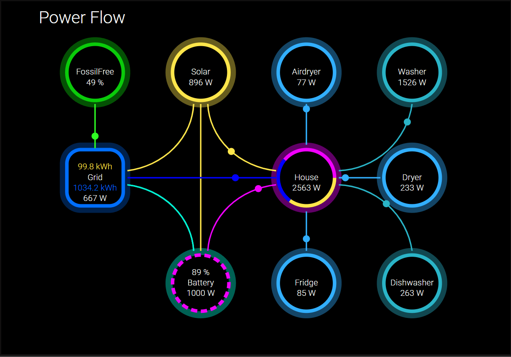

## PowerFlow für Fhem
[animiertes SVG, modifizierter dummy, javascript]



Hallo zusammen,

ich habe die Tage an einem animierten PowerFlow gebastelt. Optisch liebäugelt er mit der Powerflow Card Plus von HA.
Zusammengesetzt ist er aus einem dummy-Device, welches die Werte beherbergt und das SVG lädt sowie füttert.

Danke an @Torxgewinde, welcher mir den Weg per setValue(d) sehr gut erläutert hat.

Mit dem Baukasten können noch nicht alle, aber doch schon viele Situationen abgebildet
werden. Bzw. bis jetzt ist es mehr auf meine Bedürfnisse angepasst.

Anwendung
- Echte und fiktive Werte werden im powergrid dummy gesetzt.
- Die animierten Linien folgen der Regel größer oder kleiner als 0.
- Der Batteriering ist die Ausnahme mit stop,gridLoad,gridUnload,solarLoad und houseUnload.
- Der Hausring zeigt prozentual die Leistung von Battery,Grid und Solar an.
- Zum setzen eines Wertes in dem jeweiligen Ring, muss eine Zahl angegeben werden. Zum Beispiel "300". Das Script ergänzt das "W".
- Um einen von den Customringen auszublenden, einfach den ReadingNamen auf n/a setzen.
- Von außen könnt ihr mit einem notify, DOIF oder dem Mittel eurer Wahl die Werte setzen.
- Um Low-Carbon, bzw jetzt FossilFree zu nutzen, bietet sich https://electricitymaps.com/ an. Siehe Punkt 4.
- Um zum DeviceOverview zu kommen, versteckt sich hinter dem Logo "Powerflow" ein Link.
- Icons von fhem müssen so gesetzt werden: aurora:fhem
- Externe SVG als Data-URL von hier: https://pictogrammers.com/libraries/ . Nicht downloaden! Rechte Maustaste, Url kopieren + einfügen.

Um das SVG an euren Geschmack anzupassen, empfehle ich diese SVG-Editors:
- https://www.svgviewer.dev/
- https://boxy-svg.com/app

1. powergrid.svg

- Das Svg aus dem Anhang nach /opt/fhem/www/images/fhemSVG kopieren.
- Rechte: Eigentümer fhem / Gruppe dialout
```
set WEB rereadicons
set WEBphone rereadicons
set WEBtablet rereadicons
```

2. dummy
Anlegen oben links mit dem Pluszeichen.
```
defmod powergrid dummy
attr powergrid alias <span></span>
attr powergrid devStateIcon { \
\
    use URI::Escape;;\
\
    # Lese die Werte aus den Readings und setze Standardwerte\
    my %values = map {\
        my $default = ($_ =~ /Name_s|Link_s/ ? ($_ =~ /Link_s/ ? 'no link' : 'n/a') : 0);;\
        $_ => ReadingsVal($name, $_, $default)\
    } qw(\
        lowcarbon_i lowcarbon_v gridLink_s grid_v grid_in_v grid_out_v\
        house_i house_v solar_i solarLink_s solar_v batteryLink_s battery_v\
        battery_p batteryState_v cCircle1Icon_i cCircle1Link_s cCircle1Name_s cCircle1Power_v\
        cCircle2Icon_i cCircle2Link_s cCircle2Name_s cCircle2Power_v cCircle3Icon_i\
        cCircle3Link_s cCircle3Name_s cCircle3Power_v cCircle4Icon_i cCircle4Link_s\
        cCircle4Name_s cCircle4Power_v cCircle5Icon_i cCircle5Link_s cCircle5Name_s\
        cCircle5Power_v cCircle6Icon_i cCircle6Link_s cCircle6Name_s cCircle6Power_v\
        cCircle7Icon_i cCircle7Link_s cCircle7Name_s cCircle7Power_v cCircle8Icon_i\
        cCircle8Link_s cCircle8Name_s cCircle8Power_v cCircle9Icon_i cCircle9Link_s\
        cCircle9Name_s cCircle9Power_v\
    );;\
\
    # Hole das SVG als Template\
    my $svg = FW_makeImage('powergrid');;\
\
    # Setze die Werte im SVG\
    foreach my $key (keys %values) {\
        $svg =~ s/(<tspan class="informId_ringSVG:$key">)(.*?)(<\/tspan>)/$1$values{$key}$3/;;\
    }\
\
    # Bearbeite die SVG-Icons basierend auf der Art (intern oder extern)\
    my @icons = (\
        [$values{solar_i},     'solarCircleIcon',       '#FFE74B', 1],\
        [$values{lowcarbon_i}, 'fossilfreeCircleIcon',  '#30FF24', 1],\
        [$values{house_i},     'houseCircleIcon',       'yellow',  1],\
        [$values{cCircle1Icon_i}, 'cCircle1Icon',        '#32AFFF', ($values{cCircle1Name_s} ne 'n/a')],\
        [$values{cCircle2Icon_i}, 'cCircle2Icon',        '#32AFFF', ($values{cCircle2Name_s} ne 'n/a')],\
        [$values{cCircle3Icon_i}, 'cCircle3Icon',        '#2AB5C7', ($values{cCircle3Name_s} ne 'n/a')],\
        [$values{cCircle4Icon_i}, 'cCircle4Icon',        '#2AB5C7', ($values{cCircle4Name_s} ne 'n/a')],\
        [$values{cCircle5Icon_i}, 'cCircle5Icon',        '#32AFFF', ($values{cCircle5Name_s} ne 'n/a')],\
        [$values{cCircle6Icon_i}, 'cCircle6Icon',        '#32AFFF', ($values{cCircle6Name_s} ne 'n/a')],\
        [$values{cCircle7Icon_i}, 'cCircle7Icon',        '#2AB5C7', ($values{cCircle7Name_s} ne 'n/a')],\
        [$values{cCircle8Icon_i}, 'cCircle8Icon',        '#32AFFF', ($values{cCircle8Name_s} ne 'n/a')],\
        [$values{cCircle9Icon_i}, 'cCircle9Icon',        '#2AB5C7', ($values{cCircle9Name_s} ne 'n/a')]\
    );;\
\
    foreach my $entry (@icons) {\
        my ($icon_raw, $id, $fill, $should_process) = @$entry;;\
        next unless $should_process && $icon_raw;;\
\
        my $raw = $icon_raw;;\
        my $icon;;\
\
        if ($raw =~ s/:fhem$//) {\
            $icon = FW_makeImage("$raw\@$fill");;\
        } else {\
            $icon = uri_unescape($raw);;\
            $icon =~ s/fill="[^"]*"/fill="$fill"/g;;\
            $icon =~ s/<path(?![^>]*fill)/<path fill="$fill"/g;;\
        }\
\
        next unless defined $icon;;\
\
        $icon =~ s/\s*(width|height)="[^"]*"\s*/ /g;;\
        $icon =~ s/<svg([^>]*)/ <svg$1 width="25px" height="25px" /;;\
\
        $svg =~ s{<g id="$id"([^>]*)>}{<g id="informId_ringSVG:$id"$1>$icon };;\
    }\
\
    # Weblink Links\
    my @links = (\
        [ "do_weblink", "/fhem?detail=powergrid", 55, 30, "Powerflow", "Click here for DeviceOverview" ],\
        [ "gridLink", $values{gridLink_s}, 100, 250, "Grid", $values{gridLink_s} ],\
        [ "solarLink", $values{solarLink_s}, 250, 100, "Solar", $values{solarLink_s} ],\
        [ "batteryLink", $values{batteryLink_s}, 250, 400, "Battery", $values{batteryLink_s} ],\
        [ "cCircle1Link", $values{cCircle1Link_s}, 400, 100, "Circle1", $values{cCircle1Link_s} ],\
        [ "cCircle2Link", $values{cCircle2Link_s}, 400, 400, "Circle2", $values{cCircle2Link_s} ],\
        [ "cCircle3Link", $values{cCircle3Link_s}, 550, 100, "Circle3", $values{cCircle3Link_s} ],\
        [ "cCircle4Link", $values{cCircle4Link_s}, 550, 400, "Circle4", $values{cCircle4Link_s} ],\
        [ "cCircle5Link", $values{cCircle5Link_s}, 700, 100, "Circle5", $values{cCircle5Link_s} ],\
        [ "cCircle6Link", $values{cCircle6Link_s}, 700, 400, "Circle6", $values{cCircle6Link_s} ],\
        [ "cCircle7Link", $values{cCircle7Link_s}, 850, 100, "Circle7", $values{cCircle7Link_s} ],\
        [ "cCircle8Link", $values{cCircle8Link_s}, 850, 250, "Circle8", $values{cCircle8Link_s} ],\
        [ "cCircle9Link", $values{cCircle9Link_s}, 850, 400, "Circle9", $values{cCircle9Link_s} ]\
    );;\
\
    foreach my $link (@links) {\
        my ($id, $href, $cx, $cy, $title, $tooltip) = @$link;;\
\
        my $weblink;;\
        if ($id eq 'do_weblink') {\
            $weblink = qq(<a xlink:href="$href" target="_blank"><text x="$cx" y="$cy" font-size="24" fill="white" cursor="pointer">$title<title>$tooltip</title></text></a>);;\
        } else {\
            $weblink = qq(<a xlink:href="$href" target="_blank"><circle cx="$cx" cy="$cy" r="45" style="fill:transparent;;stroke:none;;"/><title>$tooltip</title></a>);;\
        }\
\
        $svg =~ s{<g id="$id"([^>]*)>}{<g id="$id"$1>$weblink};;\
    }\
\
    # CSS hinzufügen\
    my $extras = 'style="width: 90vw !important;;height: auto !important;;max-height: 700px;;background-color: black !important;;"';;\
    $svg =~ s/<svg([^>]*)\s*(style="[^"]*")?/<svg$1$extras/;;\
\
    return $svg;;\
\
}
attr powergrid readingList battery_v battery_p batteryState_v batteryLink_s cCircle1Icon_i cCircle1Link_s cCircle1Name_s cCircle1Power_v cCircle2Icon_i cCircle2Link_s cCircle2Name_s cCircle2Power_v cCircle3Icon_i cCircle3Link_s cCircle3Name_s cCircle3Power_v cCircle4Icon_i cCircle4Link_s cCircle4Name_s cCircle4Power_v cCircle5Icon_i cCircle5Link_s cCircle5Name_s cCircle5Power_v cCircle6Icon_i cCircle6Link_s cCircle6Name_s cCircle6Power_v cCircle7Icon_i  cCircle7Link_s cCircle7Name_s cCircle7Power_v cCircle8Icon_i cCircle8Link_s cCircle8Name_s cCircle8Power_v cCircle9Icon_i cCircle9Link_s cCircle9Name_s cCircle9Power_v dryer_v grid_v grid_in_v grid_out_v gridLink_s house_i house_v lowcarbon_i lowcarbon_v solar_i solar_v solarLink_s
attr powergrid room 15.Energy
attr powergrid setList battery_v battery_p batteryState_v:select,stop,gridLoad,gridUnload,solarLoad,houseUnload batteryLink_s cCircle1Icon_i cCircle1Link_s cCircle1Name_s cCircle1Power_v cCircle2Icon_i cCircle2Link_s cCircle2Name_s cCircle2Power_v cCircle3Icon_i cCircle3Link_s cCircle3Name_s cCircle3Power_v cCircle4Icon_i cCircle4Link_s cCircle4Name_s cCircle4Power_v cCircle5Icon_i cCircle5Link_s cCircle5Name_s cCircle5Power_v cCircle6Icon_i cCircle6Link_s cCircle6Name_s cCircle6Power_v cCircle7Icon_i cCircle7Link_s cCircle7Name_s cCircle7Power_v cCircle8Icon_i cCircle8Link_s cCircle8Name_s cCircle8Power_v cCircle9Icon_i cCircle9Link_s cCircle9Name_s cCircle9Power_v grid_v grid_in_v grid_out_v gridLink_s house_i house_v lowcarbon_i lowcarbon_v solar_i solar_v solarLink_s

```

4. Werte setzen mit notify oder DOIF
3.1 notify
```
defmod notify_Powergrid notify (Smartmeter_2E1F50:APOX_Power:.*|Smartmeter_2E1F50:statAPOX_E_inDay:.*|Smartmeter_2E1F50:statAPOX_E_outDay:.*|OpenDTU:total.Power.v:.*|electricitymap:fossilFreePercentage:.*|Luftentfeuchter:ENERGY_Power:.*|MQTT2_zigbee_Waschmaschine:power:.*|MQTT2_zigbee_Trockner:power:.*|MQTT2_zigbee_Geschirrspueler:power:.*|MQTT2_zigbee_Kuehlschrank:power:.*|Heizstab_BW_Pwr:power:.*|Server:ENERGY_Power:.*) \
{\
\
  # Smartmeter\
  if ($NAME eq "Smartmeter_2E1F50") {\
    fhem("set powergrid grid_v [Smartmeter_2E1F50:APOX_Power:d]" );;\
    fhem("set powergrid grid_in_v  →[Smartmeter_2E1F50:statAPOX_E_inDay:d]" );;\
    fhem("set powergrid grid_out_v ←[Smartmeter_2E1F50:statAPOX_E_outDay:d]" );;\
    fhem("set powergrid house_v " . (ReadingsNum("Smartmeter_2E1F50","APOX_Power", 0) + ReadingsNum("OpenDTU","total.Power.v", 0)));;\
    fhem("set powergrid lowcarbon_v  [electricitymap:fossilFreePercentage:d]" );;\
\
  # Solarinverter\
  } elsif ($NAME eq "OpenDTU") {\
    fhem("set powergrid solar_v [OpenDTU:total.Power.v:d]" );;\
\
  # Airdryer\
  } elsif ($NAME eq "Luftentfeuchter") {\
    fhem("set powergrid cCircle1Power_v [Luftentfeuchter:ENERGY_Power:d]" );;\
\
  # Washer\
  } elsif ($NAME eq "MQTT2_zigbee_Waschmaschine") {\
    fhem("set powergrid cCircle2Power_v [MQTT2_zigbee_Waschmaschine:power:d]" );;\
\
  # Dryer\
  } elsif ($NAME eq "MQTT2_zigbee_Trockner") {\
    fhem("set powergrid cCircle3Power_v [MQTT2_zigbee_Trockner:power:d]" );;\
\
  # Dishwasher\
  } elsif ($NAME eq "MQTT2_zigbee_Geschirrspueler") {\
    fhem("set powergrid cCircle4Power_v [MQTT2_zigbee_Geschirrspueler:power:d]" );;\
\
  # Fridge\
  } elsif ($NAME eq "MQTT2_zigbee_Kuehlschrank") {\
    fhem("set powergrid cCircle5Power_v [MQTT2_zigbee_Kuehlschrank:power:d]" );;\
\
  # Boiler\
  } elsif ($NAME eq "Heizstab_BW_Pwr") {\
    fhem("set powergrid cCircle6Power_v [Heizstab_BW_Pwr:power:d]" );;\
\
  # Server\
  } elsif ($NAME eq "Server") {\
    fhem("set powergrid cCircle7Power_v [Server:ENERGY_Power:d]" );;\
\
  }\
\
}

```

3.2 DOIF
```
defmod Powergrid_DOIF DOIF ## Grid + House\
([Smartmeter_2E1F50:"APOX_Power"])\
        ( set powergrid grid_v {(ReadingsNum("Smartmeter_2E1F50","APOX_Power", 0))} )\
        ( set powergrid grid_in_v {(sprintf("→ %.1f", ReadingsNum("Smartmeter_2E1F50","statAPOX_E_inDay",0)))})\
        ( set powergrid grid_out_v {(sprintf("←  %.1f",ReadingsNum("Smartmeter_2E1F50","statAPOX_E_outDay",0)))})\
        ( set powergrid house_v {(ReadingsNum("Smartmeter_2E1F50","APOX_Power", 0, 1) + ReadingsNum("OpenDTU","total.Power.v", 0, 1))} )\
        ( set powergrid lowcarbon_v {(ReadingsNum("electricitymap","fossilFreePercentage", 0))} )\
\
## Solar\
DOELSEIF  ([OpenDTU:"total.Power.v"] )\
        ( set powergrid solar_v {(ReadingsNum("OpenDTU","total.Power.v", 0, 1))} )\
\
## Airdryer\
DOELSEIF  ([Luftentfeuchter:"ENERGY_Power"])\
        ( set powergrid cCircle1Power_v {(ReadingsNum("Luftentfeuchter","ENERGY_Power",0))} )\
\
## Washer\
DOELSEIF  ([MQTT2_zigbee_Waschmaschine:"power"])\
        ( set powergrid cCircle2Power_v {(ReadingsNum("MQTT2_zigbee_Waschmaschine","power",0))} )\
\
## Dryer\
DOELSEIF  ([MQTT2_zigbee_Trockner:"power"])\
        ( set powergrid cCircle3Power_v {(ReadingsNum("MQTT2_zigbee_Trockner","power",0))} )\
\
## Dishwasher\
DOELSEIF  ([MQTT2_zigbee_Geschirrspueler:"power"])\
        ( set powergrid cCircle4Power_v {(ReadingsNum("MQTT2_zigbee_Geschirrspueler","power",0))} )\
\
## Fridge\
DOELSEIF  ([MQTT2_zigbee_Kuehlschrank:"^power:.*$"])\
        ( set powergrid cCircle5Power_v {(ReadingsNum("MQTT2_zigbee_Kuehlschrank","power",0))} )\
\
## Boiler\
DOELSEIF  ([Heizstab_BW_Pwr:"^power:.*$"])\
        ( set powergrid cCircle6Power_v {(ReadingsNum("Heizstab_BW_Pwr","power",0))} )\
\
\
\
\

```

4. Electricmap - Erzeugt das Reading für FossilFree

Laut Webseite wird ein Apikey benötigt. Es funktioniert aber auch ohne.
Update:
API-Key kann jetzt im HTTPMOD eingefügt werden. Die erforderlichen Header habe ich unten eingefügt.
Nach dem registrieren findet ihr euren API-Key unter https://portal.electricitymaps.com/dashboard.
```
defmod electricitymap HTTPMOD none 60
attr electricitymap event-on-change-reading .*
attr electricitymap extractAllJSON 1
attr electricitymap get1Header1 accept: */*
attr electricitymap get1Header2 auth-token: XpiDeinGeheimerTokenAut
attr electricitymap get1Name carbon-intensity
attr electricitymap get1Poll 1
attr electricitymap get1URL https://api.electricitymap.org/v3/carbon-intensity/latest?zone=DE
attr electricitymap get2Header1 accept: */*
attr electricitymap get2Header2 auth-token: XpiDeinGeheimerTokenAut
attr electricitymap get2Name power-breakdown
attr electricitymap get2Poll 1
attr electricitymap get2URL https://api.electricitymap.org/v3/power-breakdown/latest?zone=DE
```
