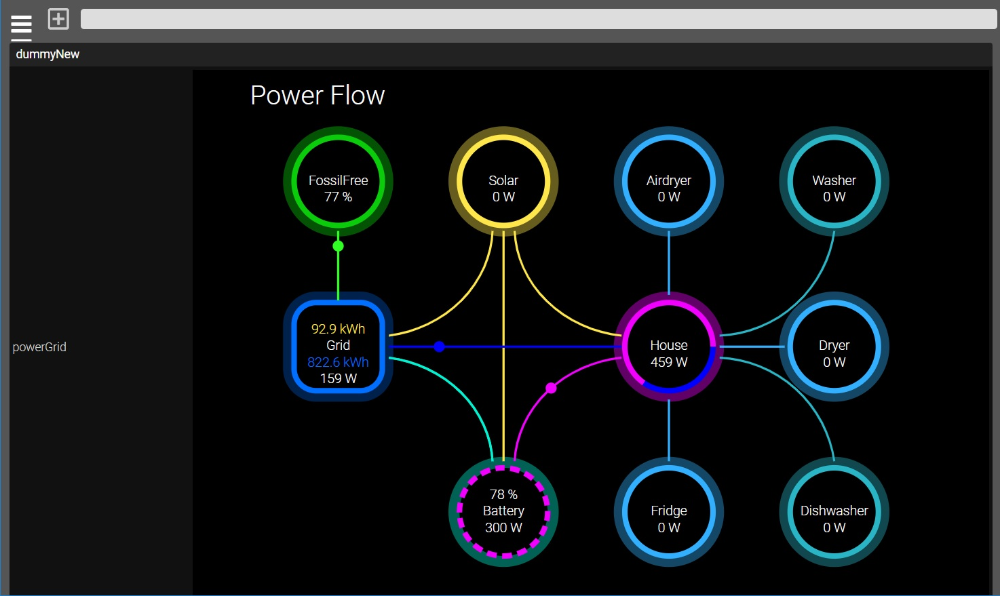

## PowerFlow für Fhem
[animiertes SVG, modifizierter dummy, javascript]



Optisch liebäugelt er mit der Powerflow Card Plus von HA.
Zusammengesetzt ist er aus einem modifizierten dummy. Dieser beherbergt die SVG-Grafik im stateFormat sowie alle Werte.
Ein Javascript liest die Werte aus und setzt sie im SVG.

Das alles ist nötig, um die Animationen in Fhem nicht zu unterbrechen. Zumindest, soweit mein Horizont bis jetzt reicht.
Vielleicht, wahrscheinlich gibt es einen eleganteren Weg.

Mit dem Baukasten können noch nicht alle, aber doch schon viele Situationen abgebildet
werden. Bzw. bis jetzt ist es mehr auf meine Bedürfnisse angepasst.

Anwendung
- Echte und fiktive Werte werden im powerGrid dummyNew gesetzt.
- Die animierten Linien folgen der Regel größer oder kleiner als 0.
- Der Batteriering ist die Ausnahme mit stop,gridLoad,gridUnload,solarLoad und houseUnload.
- Der Hausring zeigt prozentual die Leistung von Battery,Grid und Solar an.
- Zum setzen eines Wertes in dem jeweiligen Ring, muss eine Zahl angegeben werden. Zum Beispiel "300". Das Script ergänzt das "W".
- Von außen könnt ihr mit einem notify, DOIF oder dem Mittel eurer Wahl die Werte setzen.
- Um Low-Carbon, bzw jetzt FossilFree zu nutzen, bietet sich https://electricitymaps.com/ an. Siehe Punkt 6.

Um das SVG an euren Geschmack anzupassen, empfehle ich diesen SVG-Editor --> https://www.svgviewer.dev/

1. 98_dummyNew.pm Danke @Wzut, für den Hinweis, das nur eine 1 zu einer 0 geändert werden muss.
Als erstes wird ein neuer Dummy erstellt. Dazu von 98_dummy.pm den Code in 98_dummyNew.pm packen. Dann muss alles
im dummy auf dummyNew geändert.

Zum Abschluss diesen Code:
```
readingsSingleUpdate($hash, $v, join(" ",@a), 1);
```
zu diesen ändern:
```
readingsSingleUpdate($hash, $v, join(" ",@a), 0);
```
Dadurch kann jetzt das Aktualisieren des STATE unterdrückt werden.
Bedeutet, damit ist alles in einem dummy. Zum Abschluss den neuen dummy in das Verzeichnis zurück kopieren und Rechte nicht vergessen.

2. Das Javasript -> svg_update.js[Das liest die Werte aus powerGrid und setzt die Werte im SVG]
Das Javascript ist unten im Anhang. Es muss nach /opt/fhem/www/codemirror kopiert werden.
Rechte/Eigentümer : fhem/Gruppe:dialout

3. FHEMWEB (Javascript zuweisen + verbose 1)
Bei jedem FHEMWEB-Device muss der Pfad zum Javascript angegeben werden. Verbose auf 1. Bei 4 wird der Log vollgemüllt.
```
attr WEB JavaScripts codemirror/svg_update.js
attr WEB verbose 1
```
Damit das Script und der neue dummyNew korrekt eingebunden werden, müsst ihr Fhem mit "shutdown restart" neu starten.
Ist alles eingebunden und ändert ihr im Javascript etwas, müsst ihr nur euren Browsercache mit STRG + F5 leeren.

4. dummyNew[Hauptdevice zum anzeigen der Werte und Animationen]
```
defmod powerGrid dummyNew
attr powerGrid readingList airdryer_v battery_v battery_p batteryState_v dishwasher_v dryer_v fridge_v grid_v grid_in_v grid_out_v house_v lowcarbon_v solar_v solarToBattery_v washer_v
attr powerGrid room Energy
attr powerGrid setList airdryer_v:textField battery_v:textField battery_p:textField batteryState_v:select,stop,gridLoad,gridUnload,solarLoad,houseUnload dishwasher_v:textField dryer_v:textField fridge_v:textField grid_v:textField grid_in_v:textField grid_out_v:textField house_v:textField lowcarbon_v:textField solar_v:textField washer_v:textField
attr powerGrid stateFormat <!DOCTYPE html>\
<html>\
<head>\
<title>powerGrid</title>\
<style>\
#wrapper {\
    background: black;;\
}\
svg {\
    width: 100%;;\
    height: auto;;\
}\
</style>\
</head>\
<body>\
\
<div id="wrapper">\
<svg viewBox="0 0 650 500" xmlns="http://www.w3.org/2000/svg" style="background-color: black;; width: 90%;; height: auto;;">\
 \
 <!-- Titel -->\
  <text x="20" y="30" font-family="Arial" font-size="24" fill="white">Power Flow</text>\
\
  <!-- Kohlenstoffarm -->\
  <circle id="lowCarbonCircle" cx="100" cy="100" r="45" fill="none" stroke="#0ACC0A" stroke-width="10" opacity="0.4"/>\
  <circle cx="100" cy="100" r="40" fill="none" stroke="#0ACC0A" stroke-width="5"/>\
  <text x="100" y="100" font-family="Arial" font-size="12" fill="white" text-anchor="middle" alignment-baseline="middle">FossilFree</text>\
  <text id="lowCarbonPower" x="100" y="115" font-family="Arial" font-size="12" fill="white" text-anchor="middle" alignment-baseline="middle">0 %</text>\
\
  <!-- Solar -->\
  <circle id="solarCircle" cx="250" cy="100" r="45" fill="none" stroke="#FFE74B" stroke-width="10" opacity="0.4"/>\
  <circle cx="250" cy="100" r="40" fill="none" stroke="#FFE74B" stroke-width="5"/>\
  <text x="250" y="100" font-family="Arial" font-size="12" fill="white" text-anchor="middle" alignment-baseline="middle">Solar</text>\
  <text id="solarPower" x="250" y="115" font-family="Arial" font-size="12" fill="white" text-anchor="middle" alignment-baseline="middle"></text>\
\
  <!-- Netz -->\
  <rect x="55" y="205" rx="25" ry="25" width="90" height="90" fill="none" opacity="0.3" stroke="#006EFE" stroke-width="10"/>\
  <rect x="60" y="210" rx="20" ry="20" width="80" height="80" fill="none" stroke="#006EFE" stroke-width="5" />  \
  <text x="100" y="250" font-family="Arial" font-size="12" fill="white" text-anchor="middle" alignment-baseline="middle">Grid</text>\
  <text id="gridPowerOut" x="100" y="235" font-family="Arial" font-size="12" fill="#FFE74B" text-anchor="middle" alignment-baseline="middle"></text>\
  <text id="gridPowerIn" x="100" y="265" font-family="Arial" font-size="12" fill="#006EFE" text-anchor="middle" alignment-baseline="middle"></text>\
  <text id="gridPower" x="100" y="280" font-family="Arial" font-size="12" fill="white" text-anchor="middle" alignment-baseline="middle"></text>\
\
  <!-- Batterie Label -->\
  <text x="250" y="400" font-family="Arial" font-size="12" fill="white" text-anchor="middle" alignment-baseline="middle">Battery</text>\
  <text id="batteryPower" x="250" y="415" font-family="Arial" font-size="12" fill="white" text-anchor="middle" alignment-baseline="middle"></text>\
  <text id="batteryPercent" x="250" y="385" font-family="Arial" font-size="12" fill="white" text-anchor="middle" alignment-baseline="middle"></text>\
\
  <!-- Batterie stop -->\
  <circle id="batteryCircle" cx="250" cy="400" r="45" fill="none" stroke="#01F2D2" stroke-width="10" opacity="0.4"/>\
  <circle id="batteryStatic" cx="250" cy="400" r="40" fill="none" stroke="#01F2D2" stroke-width="5"/>\
\
  <!-- Batterie dreht rechts -->\
  <circle id="batteryClockwiseGridLoad" cx="250" cy="400" r="40" fill="none" stroke="#01F2D2" stroke-width="5" stroke-dasharray="9 5" stroke-dashoffset="3" style="display:none;;">\
    <animateTransform attributeName="transform" type="rotate" from="0 250 400" to="360 250 400" dur="5s" repeatCount="indefinite" />\
  </circle>\
\
  <!-- Batterie dreht rechts -->\
  <circle id="batteryClockwiseHouseUnload" cx="250" cy="400" r="40" fill="none" stroke="purple" stroke-width="5" stroke-dasharray="9 5" stroke-dashoffset="3" style="display:none;;">\
    <animateTransform attributeName="transform" type="rotate" from="0 250 400" to="360 250 400" dur="5s" repeatCount="indefinite" />\
  </circle>\
\
  <!-- Batterie dreht rechts -->\
  <circle id="batteryClockwiseSolarLoad" cx="250" cy="400" r="40" fill="none" stroke="#FFE74B" stroke-width="5" stroke-dasharray="9 5" stroke-dashoffset="3" style="display:none;;">\
    <animateTransform attributeName="transform" type="rotate" from="0 250 400" to="360 250 400" dur="5s" repeatCount="indefinite" />\
  </circle>\
\
  <!-- Batteriering dreht links -->\
  <circle id="batteryCounterclockwiseGridUnload" cx="250" cy="400" r="40" fill="none" stroke="#01F2D2" stroke-width="5" stroke-dasharray="9 5" stroke-dashoffset="3" style="display:none;;">\
    <animateTransform attributeName="transform" type="rotate" from="0 250 400" to="-360 250 400" dur="5s" repeatCount="indefinite" />\
  </circle>\
\
  <!-- Haus + Ringsegmente -->\
  <circle id="houseCircle" cx="400" cy="250" r="45" fill="none" stroke="purple" stroke-width="10" opacity="0.4"/>\
  <circle id="solarSegment" cx="400" cy="250" r="40" fill="none" stroke="#FFE74B" stroke-width="5" stroke-dasharray="0 100" />\
  <circle id="gridSegment" cx="400" cy="250" r="40" fill="none" stroke="blue" stroke-width="5" stroke-dasharray="0 100" />\
  <circle id="batterySegment" cx="400" cy="250" r="40" fill="none" stroke="purple" stroke-width="5" stroke-dasharray="0 100" />\
  <text x="400" y="250" font-family="Arial" font-size="12" fill="white" text-anchor="middle" alignment-baseline="middle">House</text>\
  <text id="housePower" x="400" y="265" font-family="Arial" font-size="12" fill="white" text-anchor="middle" alignment-baseline="middle"></text>\
\
  <!-- Lufttrockner -->\
  <circle id="airDryerCircle" cx="400" cy="100" r="45" fill="none" stroke="#32AFFF" stroke-width="10" opacity="0.4"/>\
  <circle cx="400" cy="100" r="40" fill="none" stroke="#32AFFF" stroke-width="5"/>\
  <text x="400" y="100" font-family="Arial" font-size="12" fill="white" text-anchor="middle" alignment-baseline="middle">Airdryer</text>\
  <text id="airdryerPower" x="400" y="115" font-family="Arial" font-size="12" fill="white" text-anchor="middle" alignment-baseline="middle"></text>\
\
  <!-- Kühlschrank -->\\
  <circle id="fridgeCircle" cx="400" cy="400" r="45" fill="none" stroke="#32AFFF" stroke-width="10" opacity="0.4"/>\
  <circle cx="400" cy="400" r="40" fill="none" stroke="#32AFFF" stroke-width="5"/>\
  <text x="400" y="400" font-family="Arial" font-size="12" fill="white" text-anchor="middle" alignment-baseline="middle">Fridge</text>\
  <text id="fridgePower" x="400" y="415" font-family="Arial" font-size="12" fill="white" text-anchor="middle" alignment-baseline="middle"></text>\
\
  <!-- Waschmaschine -->\
  <circle id="washerCircle" cx="550" cy="100" r="45" fill="none" stroke="#2AB5C7" stroke-width="10" opacity="0.4"/>\
  <circle cx="550" cy="100" r="40" fill="none" stroke="#2AB5C7" stroke-width="5"/>\
  <text x="550" y="100" font-family="Arial" font-size="12" fill="white" text-anchor="middle" alignment-baseline="middle">Washer</text>\
  <text id="washerPower" x="550" y="115" font-family="Arial" font-size="12" fill="white" text-anchor="middle" alignment-baseline="middle"></text>\
\
  <!-- Trockner -->\
  <circle id="dryerCircle" cx="550" cy="250" r="45" fill="none" stroke="#32AFFF" stroke-width="10" opacity="0.4"/>\
  <circle cx="550" cy="250" r="40" fill="none" stroke="#32AFFF" stroke-width="5"/>\
  <text x="550" y="250" font-family="Arial" font-size="12" fill="white" text-anchor="middle" alignment-baseline="middle">Dryer</text>\
  <text id="dryerPower" x="550" y="265" font-family="Arial" font-size="12" fill="white" text-anchor="middle" alignment-baseline="middle"></text>\
\
  <!-- Geschirrspüler -->\
  <circle id="dishwasherCircle" cx="550" cy="400" r="45" fill="none" stroke="#2AB5C7" stroke-width="10" opacity="0.4"/>\
  <circle cx="550" cy="400" r="40" fill="none" stroke="#2AB5C7" stroke-width="5"/>\
  <text x="550" y="400" font-family="Arial" font-size="12" fill="white" text-anchor="middle" alignment-baseline="middle">Dishwasher</text>\
  <text id="dishwasherPower" x="550" y="415" font-family="Arial" font-size="12" fill="white" text-anchor="middle" alignment-baseline="middle"></text>\
\
  <!-- Verbindungslinien -->\
\
  <!-- Verbindungslinie von Netz zu Haus und Solar zu Batterie -->\
  <path id="solarToBatteryPath" d="M 250 145 A 0 100 0 0 1 250 354" stroke="#FFE74B" stroke-width="2" fill="transparent"/>\
  <path id="gridToHousePath" d="M 146 250 H 357" stroke="blue" stroke-width="2" fill="transparent"/>\
  <circle r="5" fill="blue">\
    <animateMotion id="gridToHouse" dur="3s" repeatCount="indefinite">\
      <mpath href="#gridToHousePath"/>\
    </animateMotion>\
  </circle>\
  <circle r="5" fill="#FFE74B">\
    <animateMotion id="solarToBattery" dur="3s" repeatCount="indefinite" keyPoints="0;;1" keyTimes="0;;1">\
      <mpath href="#solarToBatteryPath"/>\
    </animateMotion>\
  </circle>\
\
  <!-- Verbindungslinie von Batterie zu Haus --> \
  <path id="batteryToHousePath" d="M 260 354 A 110 100 0 0 1 357 260" stroke="purple" stroke-width="2" fill="transparent"/>\
  <circle r="5" fill="purple">\
    <animateMotion id="batteryToHouse" dur="3s" repeatCount="indefinite" keyPoints="0;;1" keyTimes="0;;1">\
      <mpath href="#batteryToHousePath"/>\
    </animateMotion>\
  </circle>\
\
  <!-- Verbindungslinie von Solar zu Haus -->\
  <path id="solarToHousePath" d="M 260 145 A 110 100 0 0 0 357 240" stroke="#FFE74B" stroke-width="2" fill="transparent"/>\
  <circle r="5" fill="#FFE74B">\
    <animateMotion id="solarToHouse" dur="3s" repeatCount="indefinite" keyPoints="0;;1" keyTimes="0;;1">\
      <mpath href="#solarToHousePath"/>\
    </animateMotion>\
  </circle>\
\
  <!-- Verbindungslinie von Haus zu Lufttrockner -->\
  <path id="houseToAirdryerPath" d="M 400 203 A 0 67 0 0 1 400 145" stroke="#32AFFF" stroke-width="2" fill="transparent"/>\
  <circle r="5" fill="#32AFFF">\
    <animateMotion id="houseToAirdryer" dur="3s" repeatCount="indefinite" keyPoints="0;;1" keyTimes="0;;1">\
      <mpath href="#houseToAirdryerPath"/>\
    </animateMotion>\
  </circle>\
\
  <!-- Verbindungslinie von Haus zu Kühlschrank -->\
  <path id="houseToFridgePath" d="M 400 298 A 0 67 0 0 1 400 354" stroke="#32AFFF" stroke-width="2" fill="transparent"/>\
  <circle r="5" fill="#32AFFF">\
    <animateMotion id="houseToFridge" dur="3s" repeatCount="indefinite" keyPoints="0;;1" keyTimes="0;;1">\
      <mpath href="#houseToFridgePath"/>\
    </animateMotion>\
  </circle>\
\
  <!-- Verbindungslinie von Netz zu Kohlenstoffarm -->\
  <path id="gridToLowCarbonPath" d="M 100 145 A 0 68 0 0 1 100 208" stroke="#30FF24" stroke-width="2" fill="transparent"/>\
  <circle r="5" fill="#30FF24">\
    <animateMotion id="gridToLowCarbon" dur="3s" repeatCount="indefinite" keyPoints="0;;1" keyTimes="0;;1">\
      <mpath href="#gridToLowCarbonPath"/>\
    </animateMotion>\
  </circle>\
\
  <!-- Verbindungslinie von Haus zu Trockner -->\
  <path id="houseToDryerPath" d="M 446 250 A 0 0 0 0 1 505 250" stroke="#32AFFF" stroke-width="2" fill="transparent"/>\
  <circle r="5" fill="#32AFFF">\
    <animateMotion id="houseToDryer" dur="3s" repeatCount="indefinite" keyPoints="0;;1" keyTimes="0;;1">\
      <mpath href="#houseToDryerPath"/>\
    </animateMotion>\
  </circle>\
\
    <!-- Verbindungslinie von Haus zu Waschmaschine -->\
  <path id="houseToWasherPath" d="M 446 240 A 110 110 0 0 0 550 145" stroke="#2AB5C7" stroke-width="2" fill="transparent"/>\
  <circle r="5" fill="#2AB5C7">\
    <animateMotion id="houseToWasher" dur="3s" repeatCount="indefinite" keyPoints="0;;1" keyTimes="0;;1">\
      <mpath href="#houseToWasherPath"/>\
    </animateMotion>\
  </circle>\
\
  <!-- Verbindungslinie von Haus zu Geschirrspüler -->\
  <path id="houseToDishwasherPath" d="M 446 260 A 110 110 0 0 1 550 354" stroke="#2AB5C7" stroke-width="2" fill="transparent"/>\
  <circle r="5" fill="#2AB5C7">\
    <animateMotion id="houseToDishwasher" dur="3s" repeatCount="indefinite">\
      <mpath href="#houseToDishwasherPath"/>\
    </animateMotion>\
  </circle>\
\
  <!-- Verbindungslinie von Solar zu Netz -->\
  <path id="solarToGridPath" d="M 240 145 A 110 100 0 0 1 146 240" stroke="#FFE74B" stroke-width="2" fill="transparent"/>\
  <circle r="5" fill="#FFE74B">\
    <animateMotion id="solarToGrid" dur="3s" repeatCount="indefinite" keyPoints="0;;1" keyTimes="0;;1">\
      <mpath href="#solarToGridPath"/>\
    </animateMotion>\
  </circle>\
\
  <!-- Verbindungslinie von Netz zu Batterie -->\
  <path id="gridToBatteryPath" d="M 146 260 A 110 100 0 0 1 240 354" stroke="#01F2D2" stroke-width="2" fill="transparent"/>\
  <circle id="gridToBatteryStatic" r="5" fill="#01F2D2" style="display:none;;" />\
  <circle id="gridToBatteryForward" r="5" fill="#01F2D2" style="display:none;;">\
    <animateMotion id="gridToBatteryForwardAnim" dur="3s" repeatCount="indefinite" keyPoints="0;;1" keyTimes="0;;1">\
      <mpath href="#gridToBatteryPath"/>\
    </animateMotion>\
  </circle>\
\
  <!-- Verbindungslinie von Batterie zu Netz -->\
  <path id="batteryToGridPath" d="M 240 354 A 110 100 0 0 0 146 260" stroke="#01F2D2" stroke-width="2" fill="transparent"/>\
  <circle id="batteryToGridForward" r="5" fill="#01F2D2" style="display:none;;">\
    <animateMotion id="batteryToGridForwardAnim" dur="3s" repeatCount="indefinite" keyPoints="0;;1" keyTimes="0;;1">\
      <mpath href="#batteryToGridPath"/>\
    </animateMotion>\
  </circle>\
\
</svg>\
</div>\
</body>\
</html>\


setstate powerGrid <!DOCTYPE html>\
<html>\
<head>\
<title>powerGrid</title>\
<style>\
#wrapper {\
    background: black;;\
}\
svg {\
    width: 100%;;\
    height: auto;;\
}\
</style>\
</head>\
<body>\
\
<div id="wrapper">\
<svg viewBox="0 0 650 500" xmlns="http://www.w3.org/2000/svg" style="background-color: black;; width: 90%;; height: auto;;">\
 \
 <!-- Titel -->\
  <text x="20" y="30" font-family="Arial" font-size="24" fill="white">Power Flow</text>\
\
  <!-- Kohlenstoffarm -->\
  <circle id="lowCarbonCircle" cx="100" cy="100" r="45" fill="none" stroke="#0ACC0A" stroke-width="10" opacity="0.4"/>\
  <circle cx="100" cy="100" r="40" fill="none" stroke="#0ACC0A" stroke-width="5"/>\
  <text x="100" y="100" font-family="Arial" font-size="12" fill="white" text-anchor="middle" alignment-baseline="middle">FossilFree</text>\
  <text id="lowCarbonPower" x="100" y="115" font-family="Arial" font-size="12" fill="white" text-anchor="middle" alignment-baseline="middle">0 %</text>\
\
  <!-- Solar -->\
  <circle id="solarCircle" cx="250" cy="100" r="45" fill="none" stroke="#FFE74B" stroke-width="10" opacity="0.4"/>\
  <circle cx="250" cy="100" r="40" fill="none" stroke="#FFE74B" stroke-width="5"/>\
  <text x="250" y="100" font-family="Arial" font-size="12" fill="white" text-anchor="middle" alignment-baseline="middle">Solar</text>\
  <text id="solarPower" x="250" y="115" font-family="Arial" font-size="12" fill="white" text-anchor="middle" alignment-baseline="middle"></text>\
\
  <!-- Netz -->\
  <rect x="55" y="205" rx="25" ry="25" width="90" height="90" fill="none" opacity="0.3" stroke="#006EFE" stroke-width="10"/>\
  <rect x="60" y="210" rx="20" ry="20" width="80" height="80" fill="none" stroke="#006EFE" stroke-width="5" />  \
  <text x="100" y="250" font-family="Arial" font-size="12" fill="white" text-anchor="middle" alignment-baseline="middle">Grid</text>\
  <text id="gridPowerOut" x="100" y="235" font-family="Arial" font-size="12" fill="#FFE74B" text-anchor="middle" alignment-baseline="middle"></text>\
  <text id="gridPowerIn" x="100" y="265" font-family="Arial" font-size="12" fill="#006EFE" text-anchor="middle" alignment-baseline="middle"></text>\
  <text id="gridPower" x="100" y="280" font-family="Arial" font-size="12" fill="white" text-anchor="middle" alignment-baseline="middle"></text>\
\
  <!-- Batterie Label -->\
  <text x="250" y="400" font-family="Arial" font-size="12" fill="white" text-anchor="middle" alignment-baseline="middle">Battery</text>\
  <text id="batteryPower" x="250" y="415" font-family="Arial" font-size="12" fill="white" text-anchor="middle" alignment-baseline="middle"></text>\
  <text id="batteryPercent" x="250" y="385" font-family="Arial" font-size="12" fill="white" text-anchor="middle" alignment-baseline="middle"></text>\
\
  <!-- Batterie stop -->\
  <circle id="batteryCircle" cx="250" cy="400" r="45" fill="none" stroke="#01F2D2" stroke-width="10" opacity="0.4"/>\
  <circle id="batteryStatic" cx="250" cy="400" r="40" fill="none" stroke="#01F2D2" stroke-width="5"/>\
\
  <!-- Batterie dreht rechts -->\
  <circle id="batteryClockwiseGridLoad" cx="250" cy="400" r="40" fill="none" stroke="#01F2D2" stroke-width="5" stroke-dasharray="9 5" stroke-dashoffset="3" style="display:none;;">\
    <animateTransform attributeName="transform" type="rotate" from="0 250 400" to="360 250 400" dur="5s" repeatCount="indefinite" />\
  </circle>\
\
  <!-- Batterie dreht rechts -->\
  <circle id="batteryClockwiseHouseUnload" cx="250" cy="400" r="40" fill="none" stroke="purple" stroke-width="5" stroke-dasharray="9 5" stroke-dashoffset="3" style="display:none;;">\
    <animateTransform attributeName="transform" type="rotate" from="0 250 400" to="360 250 400" dur="5s" repeatCount="indefinite" />\
  </circle>\
\
  <!-- Batterie dreht rechts -->\
  <circle id="batteryClockwiseSolarLoad" cx="250" cy="400" r="40" fill="none" stroke="#FFE74B" stroke-width="5" stroke-dasharray="9 5" stroke-dashoffset="3" style="display:none;;">\
    <animateTransform attributeName="transform" type="rotate" from="0 250 400" to="360 250 400" dur="5s" repeatCount="indefinite" />\
  </circle>\
\
  <!-- Batteriering dreht links -->\
  <circle id="batteryCounterclockwiseGridUnload" cx="250" cy="400" r="40" fill="none" stroke="#01F2D2" stroke-width="5" stroke-dasharray="9 5" stroke-dashoffset="3" style="display:none;;">\
    <animateTransform attributeName="transform" type="rotate" from="0 250 400" to="-360 250 400" dur="5s" repeatCount="indefinite" />\
  </circle>\
\
  <!-- Haus + Ringsegmente -->\
  <circle id="houseCircle" cx="400" cy="250" r="45" fill="none" stroke="purple" stroke-width="10" opacity="0.4"/>\
  <circle id="solarSegment" cx="400" cy="250" r="40" fill="none" stroke="#FFE74B" stroke-width="5" stroke-dasharray="0 100" />\
  <circle id="gridSegment" cx="400" cy="250" r="40" fill="none" stroke="blue" stroke-width="5" stroke-dasharray="0 100" />\
  <circle id="batterySegment" cx="400" cy="250" r="40" fill="none" stroke="purple" stroke-width="5" stroke-dasharray="0 100" />\
  <text x="400" y="250" font-family="Arial" font-size="12" fill="white" text-anchor="middle" alignment-baseline="middle">House</text>\
  <text id="housePower" x="400" y="265" font-family="Arial" font-size="12" fill="white" text-anchor="middle" alignment-baseline="middle"></text>\
\
  <!-- Lufttrockner -->\
  <circle id="airDryerCircle" cx="400" cy="100" r="45" fill="none" stroke="#32AFFF" stroke-width="10" opacity="0.4"/>\
  <circle cx="400" cy="100" r="40" fill="none" stroke="#32AFFF" stroke-width="5"/>\
  <text x="400" y="100" font-family="Arial" font-size="12" fill="white" text-anchor="middle" alignment-baseline="middle">Airdryer</text>\
  <text id="airdryerPower" x="400" y="115" font-family="Arial" font-size="12" fill="white" text-anchor="middle" alignment-baseline="middle"></text>\
\
  <!-- Kühlschrank -->\\
  <circle id="fridgeCircle" cx="400" cy="400" r="45" fill="none" stroke="#32AFFF" stroke-width="10" opacity="0.4"/>\
  <circle cx="400" cy="400" r="40" fill="none" stroke="#32AFFF" stroke-width="5"/>\
  <text x="400" y="400" font-family="Arial" font-size="12" fill="white" text-anchor="middle" alignment-baseline="middle">Fridge</text>\
  <text id="fridgePower" x="400" y="415" font-family="Arial" font-size="12" fill="white" text-anchor="middle" alignment-baseline="middle"></text>\
\
  <!-- Waschmaschine -->\
  <circle id="washerCircle" cx="550" cy="100" r="45" fill="none" stroke="#2AB5C7" stroke-width="10" opacity="0.4"/>\
  <circle cx="550" cy="100" r="40" fill="none" stroke="#2AB5C7" stroke-width="5"/>\
  <text x="550" y="100" font-family="Arial" font-size="12" fill="white" text-anchor="middle" alignment-baseline="middle">Washer</text>\
  <text id="washerPower" x="550" y="115" font-family="Arial" font-size="12" fill="white" text-anchor="middle" alignment-baseline="middle"></text>\
\
  <!-- Trockner -->\
  <circle id="dryerCircle" cx="550" cy="250" r="45" fill="none" stroke="#32AFFF" stroke-width="10" opacity="0.4"/>\
  <circle cx="550" cy="250" r="40" fill="none" stroke="#32AFFF" stroke-width="5"/>\
  <text x="550" y="250" font-family="Arial" font-size="12" fill="white" text-anchor="middle" alignment-baseline="middle">Dryer</text>\
  <text id="dryerPower" x="550" y="265" font-family="Arial" font-size="12" fill="white" text-anchor="middle" alignment-baseline="middle"></text>\
\
  <!-- Geschirrspüler -->\
  <circle id="dishwasherCircle" cx="550" cy="400" r="45" fill="none" stroke="#2AB5C7" stroke-width="10" opacity="0.4"/>\
  <circle cx="550" cy="400" r="40" fill="none" stroke="#2AB5C7" stroke-width="5"/>\
  <text x="550" y="400" font-family="Arial" font-size="12" fill="white" text-anchor="middle" alignment-baseline="middle">Dishwasher</text>\
  <text id="dishwasherPower" x="550" y="415" font-family="Arial" font-size="12" fill="white" text-anchor="middle" alignment-baseline="middle"></text>\
\
  <!-- Verbindungslinien -->\
\
  <!-- Verbindungslinie von Netz zu Haus und Solar zu Batterie -->\
  <path id="solarToBatteryPath" d="M 250 145 A 0 100 0 0 1 250 354" stroke="#FFE74B" stroke-width="2" fill="transparent"/>\
  <path id="gridToHousePath" d="M 146 250 H 357" stroke="blue" stroke-width="2" fill="transparent"/>\
  <circle r="5" fill="blue">\
    <animateMotion id="gridToHouse" dur="3s" repeatCount="indefinite">\
      <mpath href="#gridToHousePath"/>\
    </animateMotion>\
  </circle>\
  <circle r="5" fill="#FFE74B">\
    <animateMotion id="solarToBattery" dur="3s" repeatCount="indefinite" keyPoints="0;;1" keyTimes="0;;1">\
      <mpath href="#solarToBatteryPath"/>\
    </animateMotion>\
  </circle>\
\
  <!-- Verbindungslinie von Batterie zu Haus --> \
  <path id="batteryToHousePath" d="M 260 354 A 110 100 0 0 1 357 260" stroke="purple" stroke-width="2" fill="transparent"/>\
  <circle r="5" fill="purple">\
    <animateMotion id="batteryToHouse" dur="3s" repeatCount="indefinite" keyPoints="0;;1" keyTimes="0;;1">\
      <mpath href="#batteryToHousePath"/>\
    </animateMotion>\
  </circle>\
\
  <!-- Verbindungslinie von Solar zu Haus -->\
  <path id="solarToHousePath" d="M 260 145 A 110 100 0 0 0 357 240" stroke="#FFE74B" stroke-width="2" fill="transparent"/>\
  <circle r="5" fill="#FFE74B">\
    <animateMotion id="solarToHouse" dur="3s" repeatCount="indefinite" keyPoints="0;;1" keyTimes="0;;1">\
      <mpath href="#solarToHousePath"/>\
    </animateMotion>\
  </circle>\
\
  <!-- Verbindungslinie von Haus zu Lufttrockner -->\
  <path id="houseToAirdryerPath" d="M 400 203 A 0 67 0 0 1 400 145" stroke="#32AFFF" stroke-width="2" fill="transparent"/>\
  <circle r="5" fill="#32AFFF">\
    <animateMotion id="houseToAirdryer" dur="3s" repeatCount="indefinite" keyPoints="0;;1" keyTimes="0;;1">\
      <mpath href="#houseToAirdryerPath"/>\
    </animateMotion>\
  </circle>\
\
  <!-- Verbindungslinie von Haus zu Kühlschrank -->\
  <path id="houseToFridgePath" d="M 400 298 A 0 67 0 0 1 400 354" stroke="#32AFFF" stroke-width="2" fill="transparent"/>\
  <circle r="5" fill="#32AFFF">\
    <animateMotion id="houseToFridge" dur="3s" repeatCount="indefinite" keyPoints="0;;1" keyTimes="0;;1">\
      <mpath href="#houseToFridgePath"/>\
    </animateMotion>\
  </circle>\
\
  <!-- Verbindungslinie von Netz zu Kohlenstoffarm -->\
  <path id="gridToLowCarbonPath" d="M 100 145 A 0 68 0 0 1 100 208" stroke="#30FF24" stroke-width="2" fill="transparent"/>\
  <circle r="5" fill="#30FF24">\
    <animateMotion id="gridToLowCarbon" dur="3s" repeatCount="indefinite" keyPoints="0;;1" keyTimes="0;;1">\
      <mpath href="#gridToLowCarbonPath"/>\
    </animateMotion>\
  </circle>\
\
  <!-- Verbindungslinie von Haus zu Trockner -->\
  <path id="houseToDryerPath" d="M 446 250 A 0 0 0 0 1 505 250" stroke="#32AFFF" stroke-width="2" fill="transparent"/>\
  <circle r="5" fill="#32AFFF">\
    <animateMotion id="houseToDryer" dur="3s" repeatCount="indefinite" keyPoints="0;;1" keyTimes="0;;1">\
      <mpath href="#houseToDryerPath"/>\
    </animateMotion>\
  </circle>\
\
    <!-- Verbindungslinie von Haus zu Waschmaschine -->\
  <path id="houseToWasherPath" d="M 446 240 A 110 110 0 0 0 550 145" stroke="#2AB5C7" stroke-width="2" fill="transparent"/>\
  <circle r="5" fill="#2AB5C7">\
    <animateMotion id="houseToWasher" dur="3s" repeatCount="indefinite" keyPoints="0;;1" keyTimes="0;;1">\
      <mpath href="#houseToWasherPath"/>\
    </animateMotion>\
  </circle>\
\
  <!-- Verbindungslinie von Haus zu Geschirrspüler -->\
  <path id="houseToDishwasherPath" d="M 446 260 A 110 110 0 0 1 550 354" stroke="#2AB5C7" stroke-width="2" fill="transparent"/>\
  <circle r="5" fill="#2AB5C7">\
    <animateMotion id="houseToDishwasher" dur="3s" repeatCount="indefinite">\
      <mpath href="#houseToDishwasherPath"/>\
    </animateMotion>\
  </circle>\
\
  <!-- Verbindungslinie von Solar zu Netz -->\
  <path id="solarToGridPath" d="M 240 145 A 110 100 0 0 1 146 240" stroke="#FFE74B" stroke-width="2" fill="transparent"/>\
  <circle r="5" fill="#FFE74B">\
    <animateMotion id="solarToGrid" dur="3s" repeatCount="indefinite" keyPoints="0;;1" keyTimes="0;;1">\
      <mpath href="#solarToGridPath"/>\
    </animateMotion>\
  </circle>\
\
  <!-- Verbindungslinie von Netz zu Batterie -->\
  <path id="gridToBatteryPath" d="M 146 260 A 110 100 0 0 1 240 354" stroke="#01F2D2" stroke-width="2" fill="transparent"/>\
  <circle id="gridToBatteryStatic" r="5" fill="#01F2D2" style="display:none;;" />\
  <circle id="gridToBatteryForward" r="5" fill="#01F2D2" style="display:none;;">\
    <animateMotion id="gridToBatteryForwardAnim" dur="3s" repeatCount="indefinite" keyPoints="0;;1" keyTimes="0;;1">\
      <mpath href="#gridToBatteryPath"/>\
    </animateMotion>\
  </circle>\
\
  <!-- Verbindungslinie von Batterie zu Netz -->\
  <path id="batteryToGridPath" d="M 240 354 A 110 100 0 0 0 146 260" stroke="#01F2D2" stroke-width="2" fill="transparent"/>\
  <circle id="batteryToGridForward" r="5" fill="#01F2D2" style="display:none;;">\
    <animateMotion id="batteryToGridForwardAnim" dur="3s" repeatCount="indefinite" keyPoints="0;;1" keyTimes="0;;1">\
      <mpath href="#batteryToGridPath"/>\
    </animateMotion>\
  </circle>\
\
</svg>\
</div>\
</body>\
</html>\
```

5. Mein DOIF
```
defmod Powergrid_DOIF DOIF ## Grid + House\
([MQTT2_Smartmeter_2E1F50:"APOX_Power"])\
        ( set powerGrid grid_v {(ReadingsNum("MQTT2_Smartmeter_2E1F50","APOX_Power",0))} )\
        ( set powerGrid grid_in_v {(ReadingsNum("MQTT2_Smartmeter_2E1F50","APOX_E_in",0))} )\
        ( set powerGrid grid_out_v {(ReadingsNum("MQTT2_Smartmeter_2E1F50","APOX_E_out",0))} )\
        ( set powerGrid house_v {(ReadingsVal("MQTT2_Smartmeter_2E1F50","APOX_Power",0) + ReadingsVal("MQTT2_OpenDTU_585584","power",0))} )\
        ( set powerGrid lowcarbon_v {(ReadingsNum("electricitymap","fossilFreePercentage",0))} )\
\
## Airdryer\
DOELSEIF  ([Luftentfeuchter:"ENERGY_Power"])\
        ( set powerGrid airdryer_v {(ReadingsNum("Luftentfeuchter","ENERGY_Power",0))} )\
\
## Dishwasher\
DOELSEIF  ([MQTT2_zigbee_Geschirrspueler:"power"])\
        ( set powerGrid dishwasher_v {(ReadingsNum("MQTT2_zigbee_Geschirrspueler","power",0))} )\
\
## Dryer\
DOELSEIF  ([MQTT2_zigbee_Trockner:"power"])\
        ( set powerGrid dryer_v {(ReadingsNum("MQTT2_zigbee_Trockner","power",0))} )\
\
## Fridge\
DOELSEIF  ([MQTT2_zigbee_Kuehlschrank:"^power:.*$"])\
        ( set powerGrid fridge_v {(ReadingsNum("MQTT2_zigbee_Kuehlschrank","power",0))} )\
\
## Solar\
DOELSEIF  ([MQTT2_OpenDTU_585584:"power"] )\
        ( set powerGrid solar_v {(ReadingsNum("MQTT2_OpenDTU_585584","power",0))} )\
\
## Washer\
DOELSEIF  ([MQTT2_zigbee_Waschmaschine:"power"])\
        ( set powerGrid washer_v {(ReadingsNum("MQTT2_zigbee_Waschmaschine","power",0))} )\


setstate Powergrid_DOIF cmd_6
setstate Powergrid_DOIF 2024-11-10 15:26:09 Device MQTT2_OpenDTU_585584
setstate Powergrid_DOIF 2024-11-10 15:26:09 cmd 6
setstate Powergrid_DOIF 2024-11-10 15:26:09 cmd_event MQTT2_OpenDTU_585584
setstate Powergrid_DOIF 2024-11-10 15:26:09 cmd_nr 6
setstate Powergrid_DOIF 2024-11-10 15:22:36 e_Luftentfeuchter_events ENERGY_Power: 0,ENERGY_TotalStartTime: 2024-08-17T10:11:53,ENERGY_Period: 4,ENERGY_Factor: 0.00,Time: 2024-11-10T16:22:35,ENERGY_ReactivePower: 0,ENERGY_Yesterday: 0.590,ENERGY_Total: 83.817,ENERGY_Current: 0.000,ENERGY_Today: 0.482,ENERGY_ApparentPower: 0,ENERGY_Voltage: 0
setstate Powergrid_DOIF 2024-11-10 15:26:09 e_MQTT2_OpenDTU_585584_events is_valid: 1,ForecastToday: 2319 Wh,ForecastTomorrow: 548 Wh
setstate Powergrid_DOIF 2024-11-10 15:26:07 e_MQTT2_Smartmeter_2E1F50_events APOX_E_in: 492.448,APOX_Power: 356
setstate Powergrid_DOIF 2024-11-10 15:24:19 e_MQTT2_zigbee_Geschirrspueler_events power: 0,indicator_mode: off/on,voltage: 225,on,energy: 14.1,linkquality: 224,last_seen: 2024-11-10T15:24:19+01:00,child_lock: UNLOCK,current: 0,countdown: 0,power_outage_memory: restore
setstate Powergrid_DOIF 2024-11-10 15:26:09 e_MQTT2_zigbee_Kuehlschrank_events power_outage_memory: restore,countdown: 0,current: 0,child_lock: UNLOCK,linkquality: 188,last_seen: 2024-11-10T15:26:09+01:00,energy: 24.72,ON,power: 0,voltage: 224,indicator_mode: off/on
setstate Powergrid_DOIF 2024-11-10 15:24:33 e_MQTT2_zigbee_Trockner_events current: 0,child_lock: UNLOCK,power_outage_memory: restore,countdown: 0,on,update_installed_version: 77,update_latest_version: 192,voltage: 225,indicator_mode: off/on,update_state: available,power: 0,last_seen: 2024-11-10T15:24:33+01:00,linkquality: 140,energy: 216.31
setstate Powergrid_DOIF 2024-11-10 15:23:31 e_MQTT2_zigbee_Waschmaschine_events update_latest_version: 192,voltage: 227,indicator_mode: off/on,update_state: available,power: 0,on,update_installed_version: 77,energy: 251.83,last_seen: 2024-11-10T15:23:31+01:00,linkquality: 100,child_lock: UNLOCK,current: 0,countdown: 0,power_outage_memory: restore
setstate Powergrid_DOIF 2024-11-10 14:16:03 mode enabled
setstate Powergrid_DOIF 2024-11-10 15:26:09 state cmd_6
```

6. Electricmap - Erzeugt das Reading für FossilFree
Laut Webseite wird ein Apikey benötigt. Es funktioniert aber auch ohne.
```
defmod electricitymap HTTPMOD none 60
attr electricitymap extractAllJSON 1
attr electricitymap get1Name carbon-intensity
attr electricitymap get1Poll 1
attr electricitymap get1URL https://api.electricitymap.org/v3/carbon-intensity/latest?lat=52.369800&lon=9.758686
attr electricitymap get2Name power-breakdown
attr electricitymap get2Poll 1
attr electricitymap get2URL https://api.electricitymap.org/v3/power-breakdown/latest?lat=52.369800&lon=9.758686
attr electricitymap room 14.PV

setstate electricitymap 2024-11-10 15:26:30 carbonIntensity 591
setstate electricitymap 2024-11-10 15:26:30 createdAt 2024-11-07T14:44:43.594Z
setstate electricitymap 2024-11-10 15:26:30 datetime 2024-11-10T14:00:00.000Z
setstate electricitymap 2024-11-10 15:26:30 emissionFactorType lifecycle
setstate electricitymap 2024-11-10 15:26:30 estimationMethod FORECASTS_HIERARCHY
setstate electricitymap 2024-11-10 15:26:30 fossilFreePercentage 37
setstate electricitymap 2024-11-10 15:26:30 isEstimated 1
setstate electricitymap 2024-11-10 15:26:30 powerConsumptionBreakdown_battery_discharge 0
setstate electricitymap 2024-11-10 15:26:30 powerConsumptionBreakdown_biomass 5809
setstate electricitymap 2024-11-10 15:26:30 powerConsumptionBreakdown_coal 18609
setstate electricitymap 2024-11-10 15:26:30 powerConsumptionBreakdown_gas 10921
setstate electricitymap 2024-11-10 15:26:30 powerConsumptionBreakdown_geothermal 34
setstate electricitymap 2024-11-10 15:26:30 powerConsumptionBreakdown_hydro 3370
setstate electricitymap 2024-11-10 15:26:30 powerConsumptionBreakdown_hydro_discharge 2000
setstate electricitymap 2024-11-10 15:26:30 powerConsumptionBreakdown_nuclear 526
setstate electricitymap 2024-11-10 15:26:30 powerConsumptionBreakdown_oil 346
setstate electricitymap 2024-11-10 15:26:30 powerConsumptionBreakdown_solar 3409
setstate electricitymap 2024-11-10 15:26:30 powerConsumptionBreakdown_unknown 358
setstate electricitymap 2024-11-10 15:26:30 powerConsumptionBreakdown_wind 2578
setstate electricitymap 2024-11-10 15:26:30 powerConsumptionTotal 47962
setstate electricitymap 2024-11-10 15:26:30 powerExportBreakdown_AT 0
setstate electricitymap 2024-11-10 15:26:30 powerExportBreakdown_BE 0
setstate electricitymap 2024-11-10 15:26:30 powerExportBreakdown_CH 0
setstate electricitymap 2024-11-10 14:59:30 powerExportBreakdown_CZ 0
setstate electricitymap 2024-11-10 15:26:30 powerExportBreakdown_DK-DK1 0
setstate electricitymap 2024-11-10 15:26:30 powerExportBreakdown_DK-DK2 0
setstate electricitymap 2024-11-10 15:26:30 powerExportBreakdown_LU 332
setstate electricitymap 2024-11-10 15:26:30 powerExportBreakdown_NL 0
setstate electricitymap 2024-11-10 15:26:30 powerExportBreakdown_NO-NO2 0
setstate electricitymap 2024-11-10 14:59:30 powerExportBreakdown_PL 0
setstate electricitymap 2024-11-10 15:26:30 powerExportTotal 332
setstate electricitymap 2024-11-10 15:26:30 powerImportBreakdown_AT 698
setstate electricitymap 2024-11-10 15:26:30 powerImportBreakdown_BE 931
setstate electricitymap 2024-11-10 15:26:30 powerImportBreakdown_CH 1629
setstate electricitymap 2024-11-10 14:59:30 powerImportBreakdown_CZ 47
setstate electricitymap 2024-11-10 15:26:30 powerImportBreakdown_DK-DK1 2355
setstate electricitymap 2024-11-10 15:26:30 powerImportBreakdown_DK-DK2 77
setstate electricitymap 2024-11-10 15:26:30 powerImportBreakdown_LU 0
setstate electricitymap 2024-11-10 15:26:30 powerImportBreakdown_NL 976
setstate electricitymap 2024-11-10 15:26:30 powerImportBreakdown_NO-NO2 1449
setstate electricitymap 2024-11-10 14:59:30 powerImportBreakdown_PL 472
setstate electricitymap 2024-11-10 15:26:30 powerImportTotal 8115
setstate electricitymap 2024-11-10 15:26:30 powerProductionBreakdown_battery_discharge
setstate electricitymap 2024-11-10 15:26:30 powerProductionBreakdown_biomass 4988
setstate electricitymap 2024-11-10 15:26:30 powerProductionBreakdown_coal 17147
setstate electricitymap 2024-11-10 15:26:30 powerProductionBreakdown_gas 9441
setstate electricitymap 2024-11-10 15:26:30 powerProductionBreakdown_geothermal 21
setstate electricitymap 2024-11-10 15:26:30 powerProductionBreakdown_hydro 1310
setstate electricitymap 2024-11-10 15:26:30 powerProductionBreakdown_hydro_discharge 1714
setstate electricitymap 2024-11-10 15:26:30 powerProductionBreakdown_nuclear
setstate electricitymap 2024-11-10 15:26:30 powerProductionBreakdown_oil 309
setstate electricitymap 2024-11-10 15:26:30 powerProductionBreakdown_solar 2996
setstate electricitymap 2024-11-10 15:26:30 powerProductionBreakdown_unknown 260
setstate electricitymap 2024-11-10 15:26:30 powerProductionBreakdown_wind 1994
setstate electricitymap 2024-11-10 15:26:30 powerProductionTotal 40179
setstate electricitymap 2024-11-10 15:26:30 renewablePercentage 36
setstate electricitymap 2024-11-10 15:26:30 updatedAt 2024-11-10T13:42:54.015Z
setstate electricitymap 2024-11-10 15:26:30 zone DE

```
